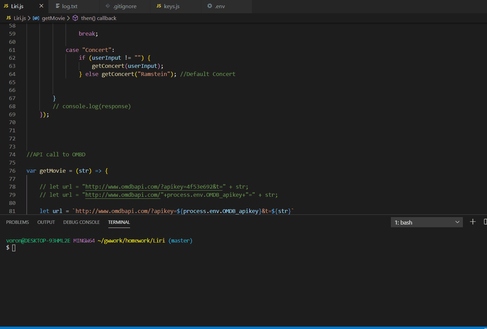

# liri-node-app
Liri is aplication that lets user search information about songs, movies and concerts. Upon Liris' start user is prompted to make a category choice.
After choice is made user is prompted to write name of the song, movie or a concert performer. 
If song is chosen by user Liri will provide following information: Artist name, Song's name, spotify link to a song and the name of the album.
If movie category is chosen, then Liri will provide following information: Title, Year, Rating, Rotten Tomatoes value, Country, Language, plot and actors.
If user chooses a concert category, then Liri provides following information: name of the venue, venue location, date of the soonest concert.
Liri pulls information from three different providers through API call. To be able access information user will need to get API keys for following providers:Spotify, Bands in Town and OMDB.

We hope you will enjoy LIRI.
